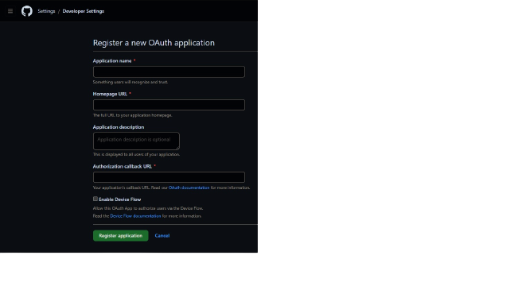

**👨‍💻 Technologies**

This project was developed with the following technologies:

- [Expo](https://expo.dev/)
- [React Native](https://reactnative.dev/)
- [Next.js](https://nextjs.org/)
- [Prisma](https://www.prisma.io/)
- [Typescript](https://www.typescriptlang.org/)
- [Eslint](https://eslint.org/)
- [TailwindCSS](https://tailwindcss.com/)
- [Fastify](https://www.fastify.io/)

-----------------------------------------------------------------------------------------------------------------------------------------------------------------------------------

**💻 Project**

Spacetime is a time capsule where the user can log in and add important events that happened in his life.

-----------------------------------------------------------------------------------------------------------------------------------------------------------------------------------

**🚀 How to run**

- Clone the repository `git clone https://github.com/matheusgomessouza/spacetime.git`

- Create a new OAuth app in Github: Settings > Developer Settings > New OAuth App  

There you should insert the **Authorization callback URL** that is YOUR_IP:PORT, after both OAuth are created we need to copy the Client ID and Client Secret,
MOBILE: exp://YOUR_IP:19000  
WEB: http://localhost:3000/api/auth/callback  

- Create an `.env` file on the root of `server` folder, and paste the Client ID and Client Secret from both OAuth apps and, the `DATABASE_URL="file:./dev.db"` ( you will have to comment one of the Github OAuth app depending on which application you are running ( web or mobile ) and then restart your server.

- On your `app.json` file on the root of `mobile` folder replace `YOUR_IP_ADRESS` for the IP of your machine.
- Create an `.env.local` file on the root of `web` folder and create the variables:

`NEXT_PUBLIC_GITHUB_CLIENT_ID` with the Client ID of your web OAuth app on Github  
`NEXT_PUBLIC_IP` with the IP of your machine.

- Start the backend located on `\server` with `npm run dev`
- Start the frontend located on `\web` folder and run `npm run dev`
- Or start the mobile located `\mobile` folder and run `npm run start` ( you can use  and run in your mobile device, or use Android / IOS emulator )

OBS: Use `npx expo start --clear` if you need to run with cleared cache.

-----------------------------------------------------------------------------------------------------------------------------------------------------------------------------------

**🧑🏾‍💻 Author**

**Matheus Gomes de Souza**

LinkedIn: https://www.linkedin.com/in/matheus-gomes-de-souza/  
E-mail: matheusg_souza@outlook.com
